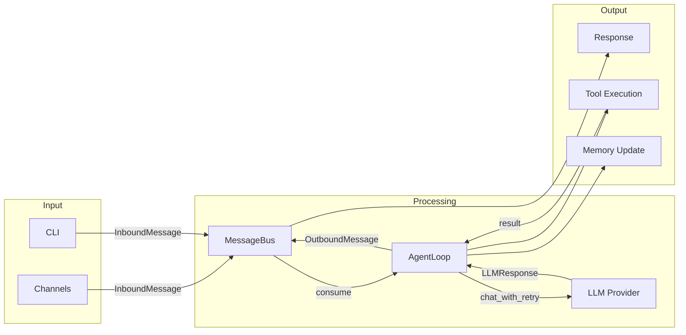
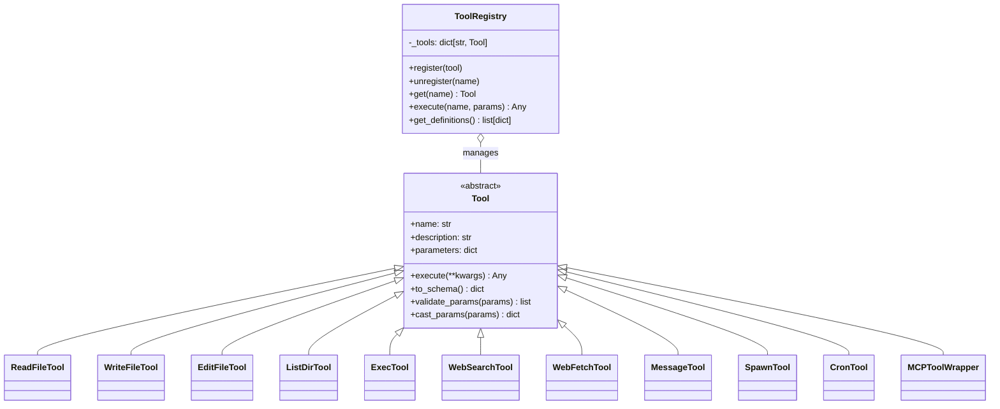
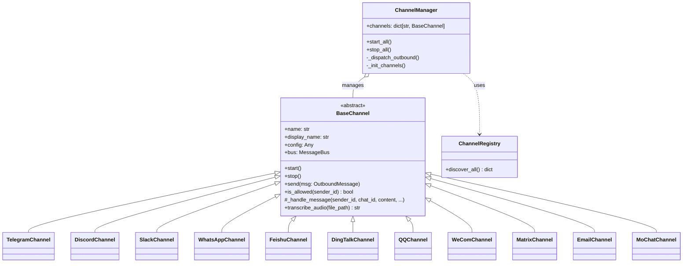
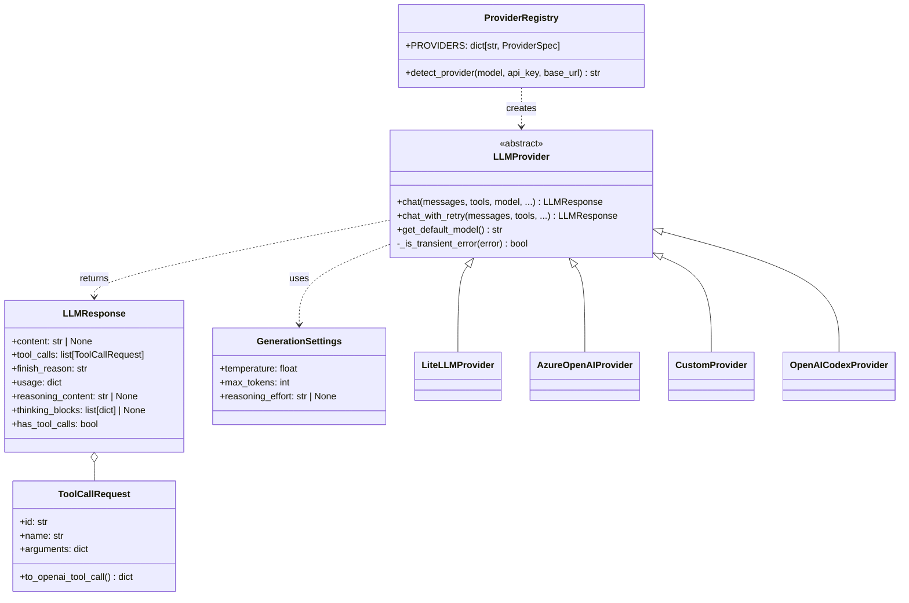
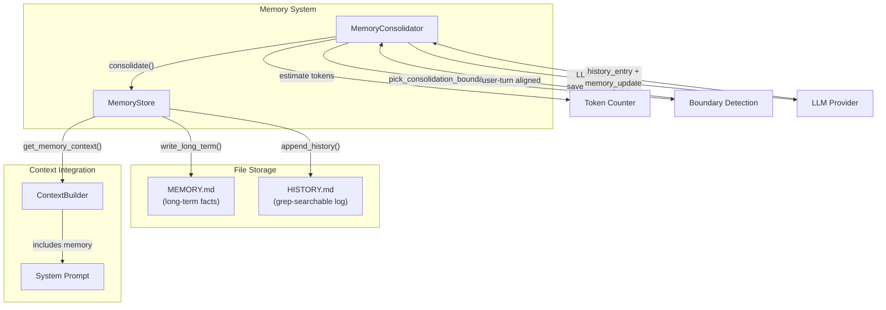
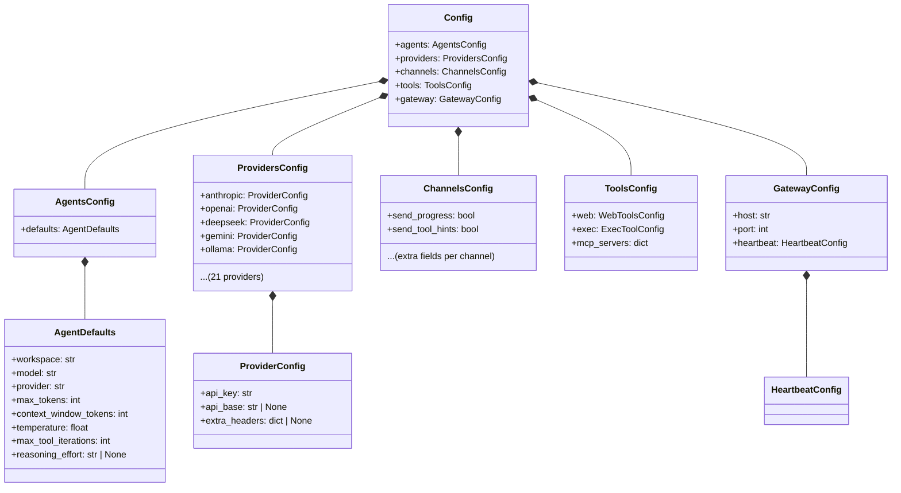

# 02. Block Diagram

## System Architecture Overview

```mermaid
graph TB
    subgraph User["User Layer"]
        CLI["CLI<br/>(nanobot agent)"]
        TG["Telegram"]
        DC["Discord"]
        SL["Slack"]
        WA["WhatsApp"]
        FS["Feishu"]
        DT["DingTalk"]
        OC["Other Channels<br/>(QQ, WeCom, Matrix,<br/>Email, MoChat)"]
    end

    subgraph Gateway["Gateway Layer"]
        CM["ChannelManager"]
        CR["ChannelRegistry<br/>(pkgutil + entry_points)"]
    end

    subgraph Bus["Message Bus Layer"]
        IQ["Inbound Queue<br/>(asyncio.Queue)"]
        OQ["Outbound Queue<br/>(asyncio.Queue)"]
    end

    subgraph Core["Agent Core"]
        AL["AgentLoop"]
        CB["ContextBuilder"]
        TR["ToolRegistry"]
        SM["SubagentManager"]
        MC["MemoryConsolidator"]
    end

    subgraph Tools["Tool Layer"]
        FT["Filesystem Tools<br/>(read, write, edit, ls)"]
        ST["Shell Tool<br/>(exec)"]
        WT["Web Tools<br/>(search, fetch)"]
        MT["Message Tool"]
        SPT["Spawn Tool"]
        CT["Cron Tool"]
        MCP["MCP Tools<br/>(external servers)"]
    end

    subgraph LLM["LLM Provider Layer"]
        PR["Provider Registry"]
        AN["Anthropic"]
        OA["OpenAI"]
        DS["DeepSeek"]
        GM["Gemini"]
        OL["Ollama"]
        OT["Other Providers<br/>(21+ total)"]
    end

    subgraph Persistence["Persistence Layer"]
        SS["SessionManager<br/>(JSONL)"]
        MS["MemoryStore<br/>(MEMORY.md)"]
        HS["History Store<br/>(HISTORY.md)"]
        CS["CronStore<br/>(JSON)"]
        CF["Config<br/>(config.json)"]
    end

    subgraph Services["Background Services"]
        CRS["CronService"]
        HBS["HeartbeatService"]
    end

    %% User → Gateway
    TG & DC & SL & WA & FS & DT & OC --> CM
    CM --> CR

    %% CLI direct
    CLI --> IQ

    %% Gateway ↔ Bus
    CM -->|"publish_inbound()"| IQ
    OQ -->|"consume_outbound()"| CM
    CM -->|"channel.send()"| TG & DC & SL & WA & FS & DT & OC

    %% Bus ↔ Core
    IQ -->|"consume_inbound()"| AL
    AL -->|"publish_outbound()"| OQ

    %% Core internal
    AL --> CB
    AL --> TR
    AL --> SM
    AL --> MC

    %% Tools
    TR --> FT & ST & WT & MT & SPT & CT & MCP

    %% LLM
    AL -->|"chat_with_retry()"| PR
    PR --> AN & OA & DS & GM & OL & OT

    %% Persistence
    AL --> SS
    MC --> MS & HS
    CRS --> CS

    %% Services → Bus
    CRS -->|"scheduled messages"| IQ
    HBS -->|"heartbeat triggers"| IQ

    %% Subagent
    SM -->|"spawn background tasks"| PR
    SM -->|"announce results"| IQ
```

## Component Relationships (Simplified)

## Tool System Architecture

## Channel System Architecture

## Provider System Architecture

## Memory System Architecture

## Configuration Schema

