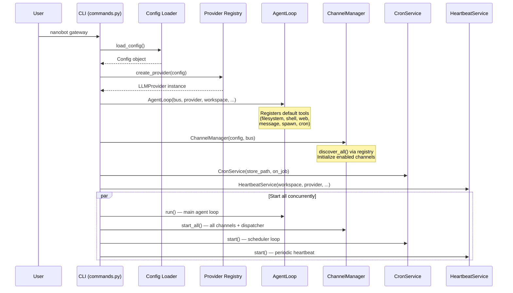
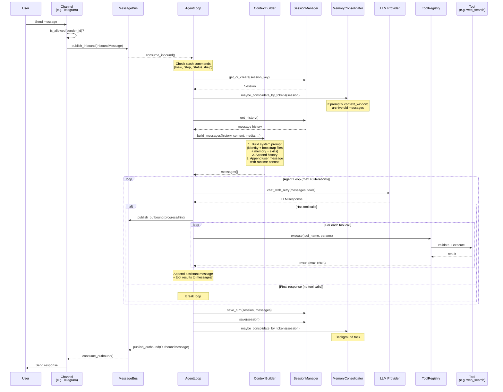
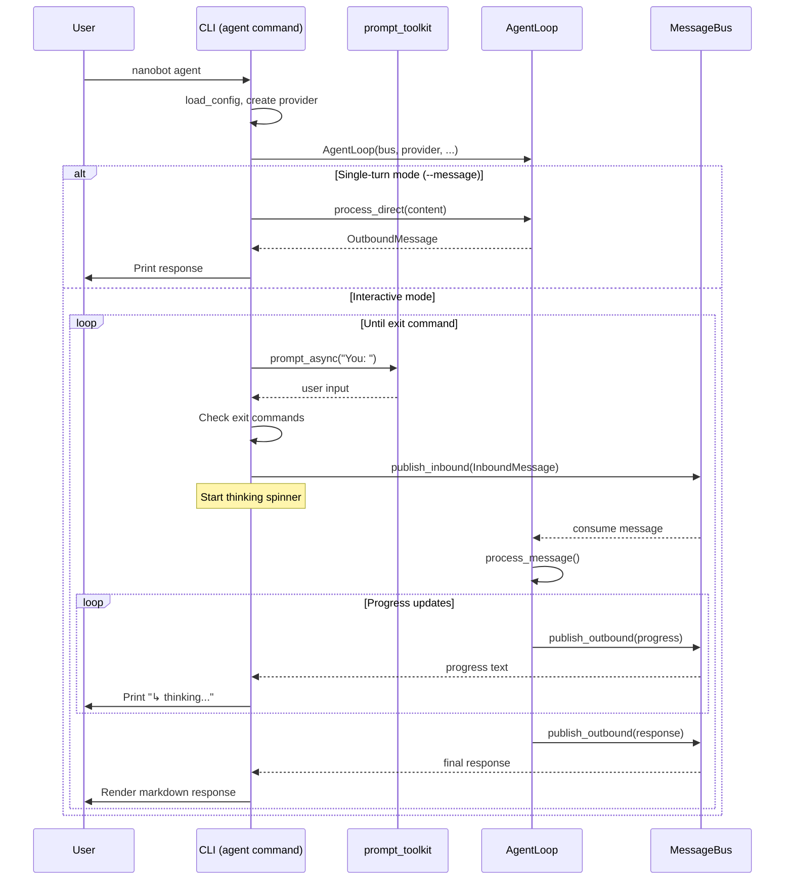
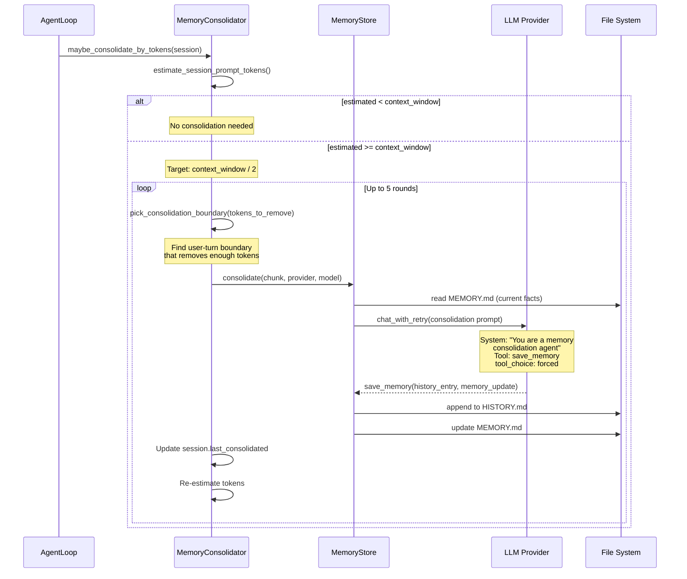
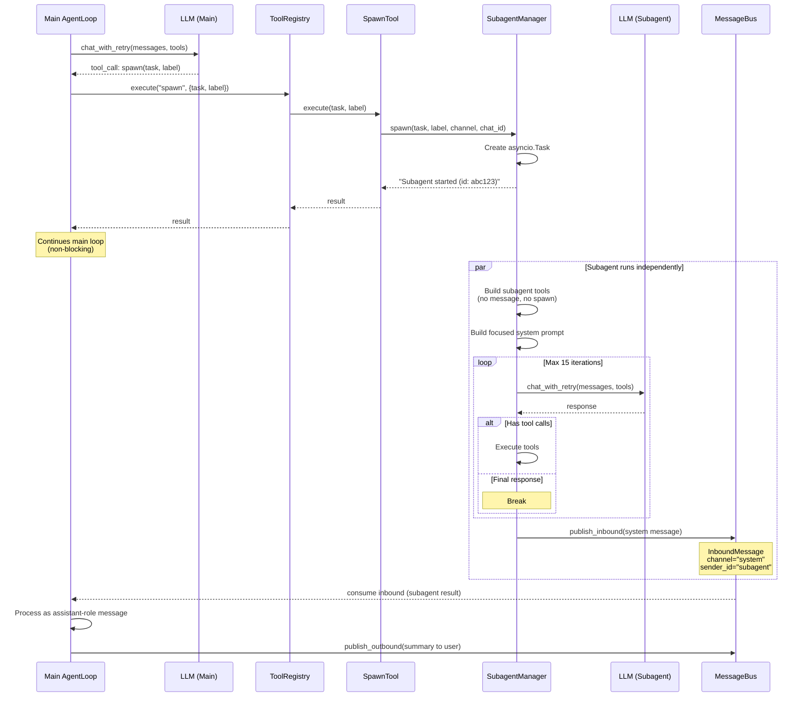
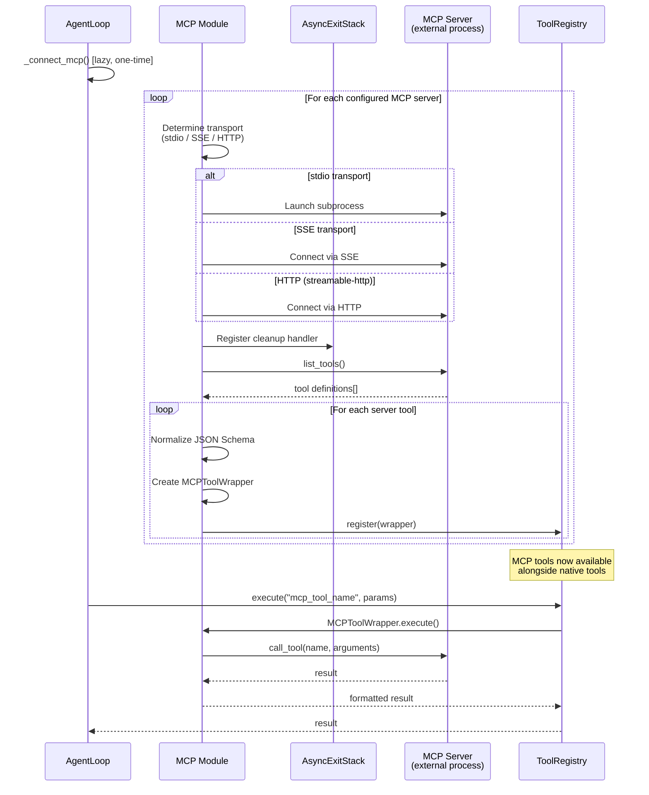
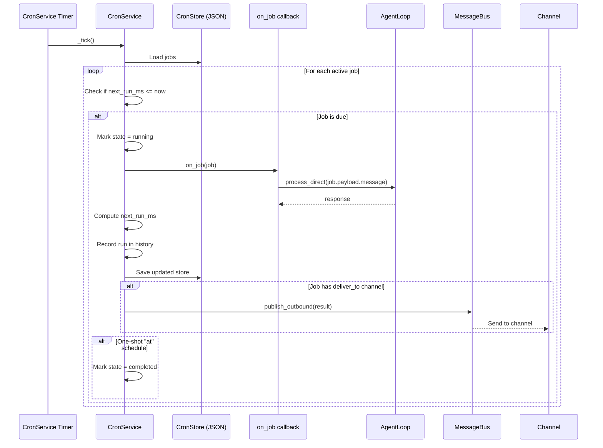
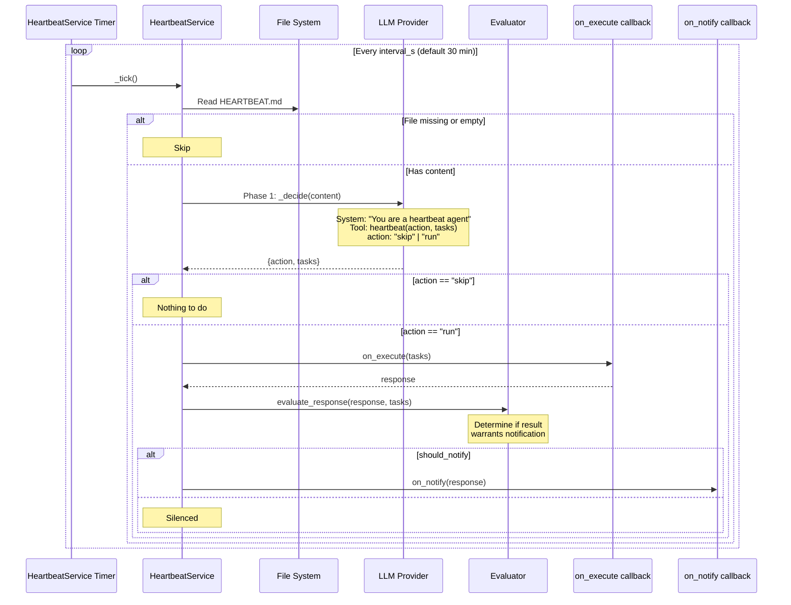

# 03. Sequence Diagrams

## 1. Gateway Mode Startup

## 2. Message Processing Flow (Gateway Mode)

## 3. Agent Mode (CLI) Interaction

## 4. Memory Consolidation Process

## 5. Subagent Execution Flow

## 6. MCP Tool Integration

## 7. Cron Job Execution

## 8. Heartbeat Service Flow

