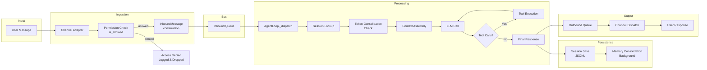
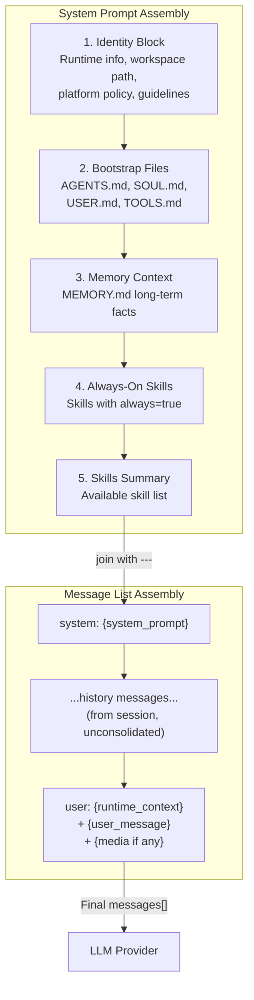
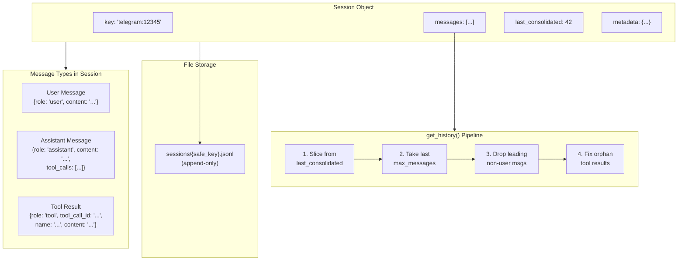
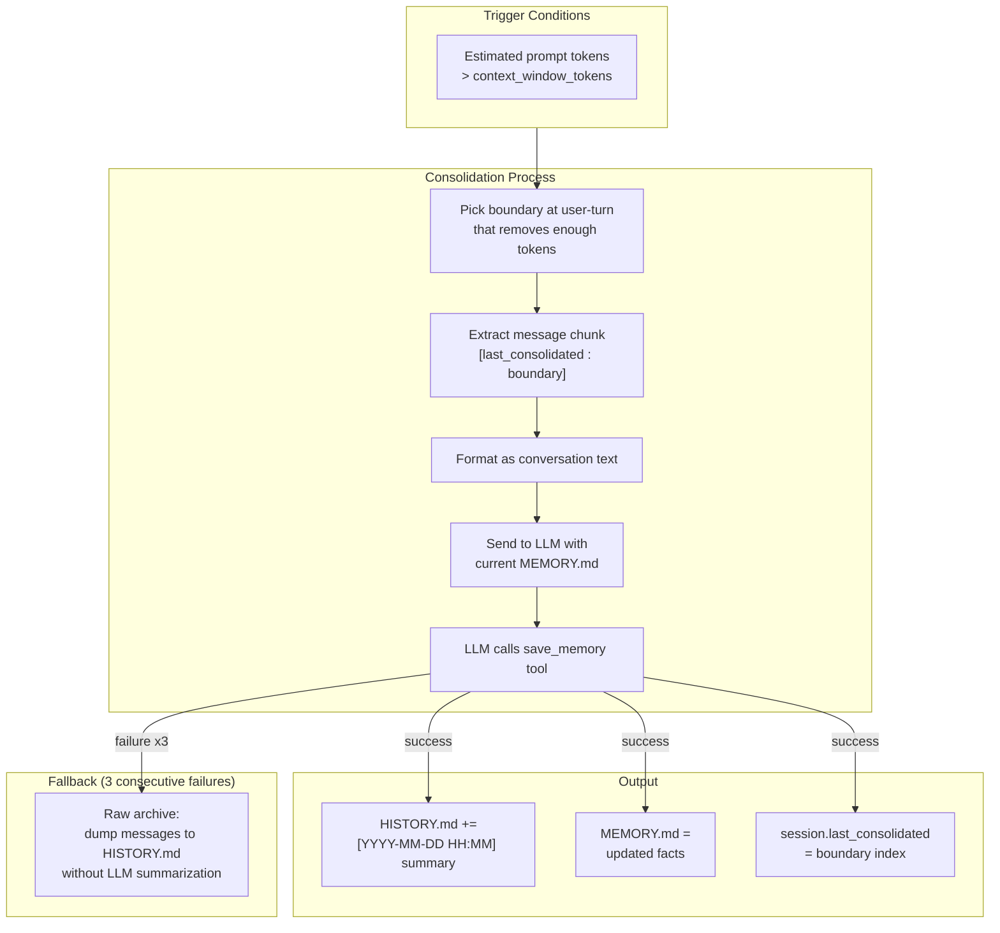
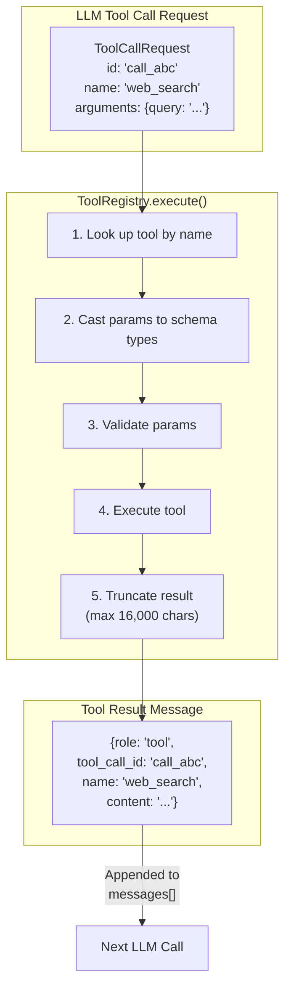
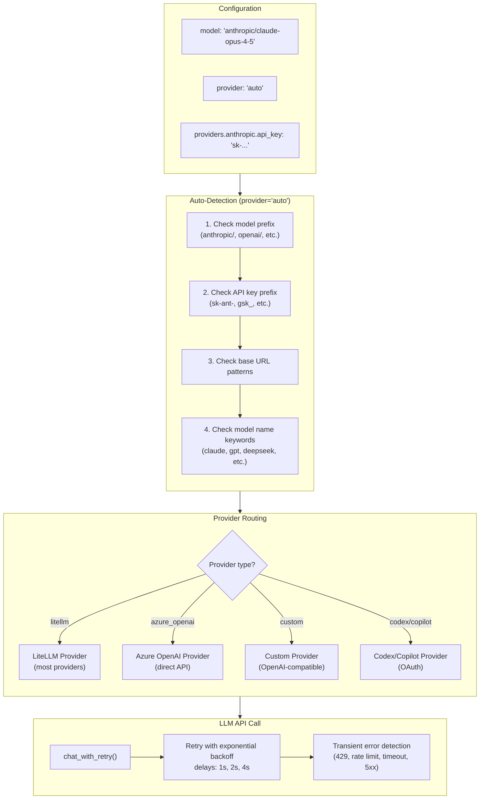
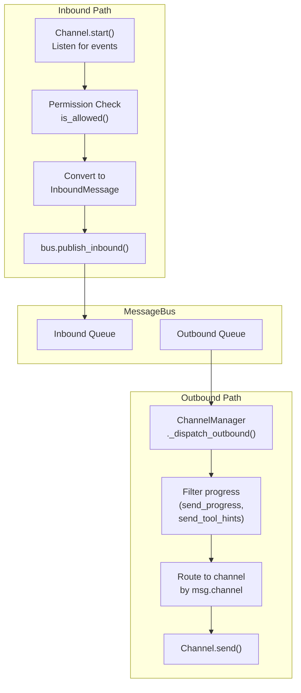
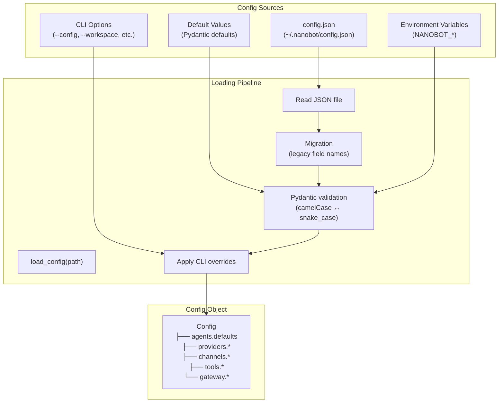

# 04. Data Flow

## 1. End-to-End Message Lifecycle



## 2. Context Assembly Pipeline

The `ContextBuilder.build_messages()` method assembles the complete prompt sent to the LLM.



### System Prompt Structure

```
# nanobot 🐈                              ← Identity
You are nanobot, a helpful AI assistant.
## Runtime / Workspace / Platform Policy / Guidelines

---

## AGENTS.md                               ← Bootstrap files
{user-customized agent persona}

## SOUL.md
{behavior guidelines}

## USER.md / TOOLS.md

---

# Memory                                   ← Long-term memory
## Long-term Memory
{content of MEMORY.md}

---

# Active Skills                            ← Always-on skills
{loaded SKILL.md content}

---

# Skills                                   ← Available skills catalog
| Skill | Description | Available |
```

## 3. Session Data Model



### Session Key Format

```
{channel}:{chat_id}

Examples:
  telegram:12345678
  discord:987654321
  slack:C01ABC123:thread_ts=1234567890.123456
  cli:direct
```

## 4. Memory Consolidation Data Flow



### Token Budget

```
context_window_tokens (e.g. 65,536)
├── System Prompt (~2,000-5,000 tokens)
├── Tool Definitions (~1,000-3,000 tokens)
├── History Messages (variable)
└── Current User Message + Response

Consolidation Target: context_window / 2 (e.g. 32,768)
Max Consolidation Rounds: 5
```

## 5. Tool Execution Data Flow



## 6. Provider Selection and Routing



## 7. Channel Message Routing



### InboundMessage Fields

| Field | Type | Description |
|-------|------|-------------|
| `channel` | `str` | Channel name (telegram, discord, slack, ...) |
| `sender_id` | `str` | User identifier on the platform |
| `chat_id` | `str` | Chat/channel/room identifier |
| `content` | `str` | Message text |
| `timestamp` | `datetime` | Message timestamp |
| `media` | `list[str]` | Media file paths (images, audio) |
| `metadata` | `dict` | Channel-specific data (reply context, etc.) |
| `session_key_override` | `str \| None` | Optional override for thread-scoped sessions |

### OutboundMessage Fields

| Field | Type | Description |
|-------|------|-------------|
| `channel` | `str` | Target channel name |
| `chat_id` | `str` | Target chat identifier |
| `content` | `str` | Response text |
| `reply_to` | `str \| None` | Message ID to reply to |
| `media` | `list[str]` | Media attachments |
| `metadata` | `dict` | Routing metadata (_progress, _tool_hint, render_as) |

## 8. Configuration Loading Pipeline


