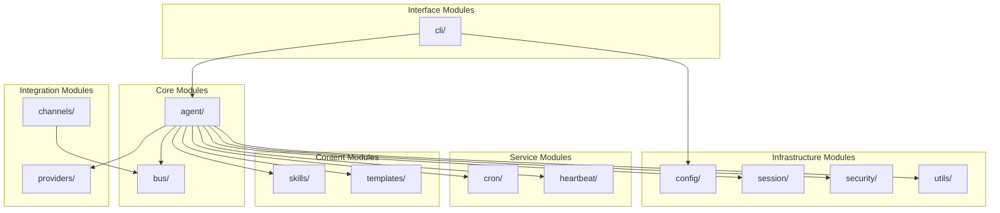

# 05. Module Reference

## Module Overview



---

## 1. agent/ — Core Agent Engine

The central processing module that orchestrates message handling, LLM interaction, tool execution, and memory management.

### agent/loop.py — `AgentLoop`

**Purpose:** Main message processing loop. Receives messages from the bus, coordinates context building, LLM calls, tool execution, and response delivery.

**Key Class:** `AgentLoop`

| Method | Description |
|--------|-------------|
| `__init__(bus, provider, workspace, ...)` | Initialize with bus, LLM provider, workspace path, and configuration options |
| `run()` | Main event loop — consumes inbound messages, dispatches as async tasks |
| `stop()` | Signal the loop to stop |
| `process_direct(content, ...)` | Process a single message directly (used by CLI agent mode) |
| `_run_agent_loop(messages, on_progress)` | Inner iteration loop — calls LLM, executes tools, up to `max_iterations` (default 40) |
| `_process_message(msg, ...)` | Full message processing pipeline (session, context, LLM, save) |
| `_register_default_tools()` | Register filesystem, shell, web, message, spawn, cron tools |
| `_connect_mcp()` | Lazy one-time connection to configured MCP servers |
| `_save_turn(session, messages, skip)` | Persist new messages to session (with truncation and sanitization) |
| `close_mcp()` | Drain background tasks and close MCP connections |

**Key Properties:**
- `_TOOL_RESULT_MAX_CHARS = 16,000` — Maximum tool result size before truncation
- `max_iterations = 40` — Default maximum LLM call iterations per message
- `_processing_lock` — Global lock ensuring one message processes at a time

**Slash Commands Handled:**
| Command | Action |
|---------|--------|
| `/new` | Clear session, archive to memory |
| `/stop` | Cancel active tasks and subagents |
| `/restart` | Restart process via `os.execv` |
| `/status` | Return runtime status |
| `/help` | List available commands |

---

### agent/context.py — `ContextBuilder`

**Purpose:** Assembles the complete prompt (system message + history + user message) for LLM calls.

**Key Class:** `ContextBuilder`

| Method | Description |
|--------|-------------|
| `build_system_prompt(skill_names)` | Build system prompt from identity, bootstrap files, memory, and skills |
| `build_messages(history, current_message, media, ...)` | Build complete message list for LLM call |
| `add_tool_result(messages, tool_call_id, name, result)` | Append tool result to message list |
| `add_assistant_message(messages, content, tool_calls, ...)` | Append assistant message to message list |

**System Prompt Components (in order):**
1. **Identity** — Runtime info, workspace path, platform policy, guidelines
2. **Bootstrap Files** — `AGENTS.md`, `SOUL.md`, `USER.md`, `TOOLS.md` from workspace
3. **Memory** — Long-term facts from `MEMORY.md`
4. **Active Skills** — Skills with `always=true` flag
5. **Skills Summary** — Catalog of available skills

**Subcomponents Used:**
- `MemoryStore` — reads `MEMORY.md` for context
- `SkillsLoader` — discovers and loads skill definitions

---

### agent/memory.py — `MemoryStore` + `MemoryConsolidator`

**Purpose:** Two-layer persistent memory system and token-based consolidation engine.

#### `MemoryStore`

Manages file-based memory (MEMORY.md + HISTORY.md).

| Method | Description |
|--------|-------------|
| `read_long_term()` | Read `MEMORY.md` |
| `write_long_term(content)` | Overwrite `MEMORY.md` |
| `append_history(entry)` | Append to `HISTORY.md` |
| `get_memory_context()` | Format memory for system prompt |
| `consolidate(messages, provider, model)` | LLM-driven consolidation via `save_memory` tool |

**Consolidation Strategy:**
1. Send conversation chunk + current memory to LLM
2. LLM calls `save_memory` tool with `history_entry` and `memory_update`
3. `history_entry` appended to HISTORY.md (grep-searchable)
4. `memory_update` replaces MEMORY.md (updated facts)
5. **Fallback:** After 3 consecutive failures, raw-archive messages without LLM

#### `MemoryConsolidator`

Owns consolidation policy, session offset tracking, and token estimation.

| Method | Description |
|--------|-------------|
| `maybe_consolidate_by_tokens(session)` | Auto-consolidate when prompt exceeds context window |
| `pick_consolidation_boundary(session, tokens_to_remove)` | Find user-turn boundary for safe truncation |
| `estimate_session_prompt_tokens(session)` | Estimate current prompt token count |
| `archive_messages(messages)` | Force-archive with guaranteed persistence |

**Consolidation Parameters:**
- Target: `context_window_tokens / 2`
- Max rounds per consolidation: 5
- Boundary alignment: user-turn boundaries only

---

### agent/skills.py — `SkillsLoader`

**Purpose:** Discovers, loads, and categorizes skills from workspace and built-in directories.

| Method | Description |
|--------|-------------|
| `build_skills_summary()` | Build markdown table of all available skills |
| `get_always_skills()` | Return skills with `always=true` |
| `load_skills_for_context(names)` | Load SKILL.md content for specified skills |

**Skill Discovery Locations:**
1. `{workspace}/skills/{name}/SKILL.md` — User custom skills
2. `nanobot/skills/{name}/SKILL.md` — Built-in skills

**Built-in Skills:** `clawhub`, `cron`, `github`, `memory`, `skill-creator`, `summarize`, `tmux`, `weather`

---

### agent/subagent.py — `SubagentManager`

**Purpose:** Spawns and manages background agent tasks that run independently of the main conversation.

| Method | Description |
|--------|-------------|
| `spawn(task, label, ...)` | Create a background asyncio task |
| `cancel_by_session(session_key)` | Cancel all subagents for a session |
| `get_running_count()` | Count currently running subagents |

**Subagent Characteristics:**
- Maximum 15 iterations (vs 40 for main agent)
- Has filesystem, shell, and web tools
- No `message` or `spawn` tools (cannot send messages or spawn further subagents)
- Results announced via bus as system messages with `sender_id="subagent"`

---

### agent/tools/ — Tool Subsystem

#### tools/base.py — `Tool` ABC

**Purpose:** Abstract base class for all tools with JSON Schema validation and type casting.

| Property/Method | Description |
|--------|-------------|
| `name` | Tool identifier used in function calls |
| `description` | Human-readable description |
| `parameters` | JSON Schema for parameters |
| `execute(**kwargs)` | Execute the tool |
| `to_schema()` | Convert to OpenAI function-calling format |
| `validate_params(params)` | Validate against JSON Schema |
| `cast_params(params)` | Auto-cast string values to schema types |

#### tools/registry.py — `ToolRegistry`

| Method | Description |
|--------|-------------|
| `register(tool)` | Add a tool |
| `unregister(name)` | Remove a tool |
| `get(name)` | Look up by name |
| `execute(name, params)` | Validate, cast, and execute |
| `get_definitions()` | All tools in OpenAI schema format |

**Error Handling:** On execution error, appends `[Analyze the error above and try a different approach.]` hint to guide the LLM.

#### tools/filesystem.py

| Tool | Description |
|------|-------------|
| `ReadFileTool` | Read file content (supports images natively) |
| `WriteFileTool` | Write/create files |
| `EditFileTool` | Search-and-replace editing |
| `ListDirTool` | List directory contents |

All filesystem tools support `allowed_dir` restriction for workspace sandboxing.

#### tools/shell.py — `ExecTool`

| Feature | Description |
|---------|-------------|
| Execution | Run shell commands via `asyncio.create_subprocess_shell` |
| Timeout | Configurable (default from config) |
| Workspace restriction | Optional containment to workspace directory |
| PATH append | Add custom directories to PATH |

#### tools/web.py

| Tool | Description |
|------|-------------|
| `WebSearchTool` | Web search via configurable providers (brave, tavily, duckduckgo, searxng, jina) |
| `WebFetchTool` | Fetch URL content with proxy support |

#### tools/mcp.py — `MCPToolWrapper`

**Purpose:** Wraps MCP (Model Context Protocol) server tools as native nanobot tools.

**Supported Transports:**
- `stdio` — Subprocess communication
- `sse` — Server-Sent Events
- `streamable-http` — HTTP streaming

**Schema Normalization:** Converts MCP JSON Schema (with nullable unions, oneOf/anyOf) to OpenAI-compatible format.

#### tools/message.py — `MessageTool`

| Feature | Description |
|---------|-------------|
| Direct messaging | Send to specific channel:chat_id |
| Turn tracking | Tracks if message was sent in current turn |
| Context | Requires channel/chat_id context from AgentLoop |

#### tools/spawn.py — `SpawnTool`

Delegates to `SubagentManager.spawn()` for background task creation.

#### tools/cron.py — `CronTool`

| Operation | Description |
|-----------|-------------|
| `add` | Create a scheduled job |
| `list` | List all jobs |
| `remove` | Delete a job |
| `toggle` | Enable/disable a job |

---

## 2. bus/ — Message Bus

**Purpose:** Decoupled async communication between channels and agent core.

### bus/queue.py — `MessageBus`

| Method | Description |
|--------|-------------|
| `publish_inbound(msg)` | Channel → Agent (user messages, system events) |
| `consume_inbound()` | Agent pulls next message (blocking) |
| `publish_outbound(msg)` | Agent → Channel (responses, progress) |
| `consume_outbound()` | Channel pulls next response (blocking) |

**Implementation:** Two `asyncio.Queue` instances (inbound, outbound). No persistence — purely in-memory runtime communication.

### bus/events.py — Event Types

| Class | Fields | Description |
|-------|--------|-------------|
| `InboundMessage` | channel, sender_id, chat_id, content, timestamp, media, metadata, session_key_override | Message from user or system |
| `OutboundMessage` | channel, chat_id, content, reply_to, media, metadata | Response to deliver |

**Session Key:** Derived as `{channel}:{chat_id}` unless overridden by `session_key_override` (used for thread-scoped sessions).

---

## 3. channels/ — Chat Platform Integrations

**Purpose:** Abstract chat platform communication into a unified interface.

### channels/base.py — `BaseChannel` ABC

| Method | Description |
|--------|-------------|
| `start()` | Connect to platform, begin listening |
| `stop()` | Disconnect and cleanup |
| `send(msg)` | Send outbound message |
| `is_allowed(sender_id)` | Check permission (allow_from list) |
| `_handle_message(...)` | Convert platform event → InboundMessage → bus |
| `transcribe_audio(file_path)` | Transcribe audio via Groq Whisper |

**Permission Model:**
- Empty `allow_from` → deny all (fatal error at startup)
- `["*"]` → allow all
- `["12345", "67890"]` → allow specific user IDs

### channels/manager.py — `ChannelManager`

| Method | Description |
|--------|-------------|
| `_init_channels()` | Discover and initialize enabled channels |
| `start_all()` | Start all channels + outbound dispatcher |
| `stop_all()` | Gracefully stop all channels |
| `_dispatch_outbound()` | Route outbound messages to correct channel |

**Channel Discovery:** Uses `channels/registry.py` which scans via:
1. `pkgutil.walk_packages` — built-in channel modules
2. `importlib.metadata.entry_points` — third-party plugins

**Progress Filtering:**
- `send_progress=true` — stream partial LLM text to channels
- `send_tool_hints=false` — suppress tool-call hints by default

### Supported Channels

| Channel | Key Features |
|---------|-------------|
| **Telegram** | Reply context, media handling, draft streaming, markdown formatting |
| **Discord** | Message splitting (2000 char limit), rich embeds |
| **Slack** | Thread isolation, file upload, mrkdwn formatting |
| **WhatsApp** | Baileys bridge (TypeScript), media download |
| **Feishu** | Rich card messages, reply threading, table support |
| **DingTalk** | Rich media, group chat support |
| **QQ** | Group/private chat |
| **WeCom** | WeChat Work API |
| **Matrix** | E2E encryption support |
| **Email** | IMAP polling, SMTP sending |
| **MoChat** | Custom chat integration |

---

## 4. providers/ — LLM Provider Abstractions

**Purpose:** Unified interface for interacting with 21+ LLM providers.

### providers/base.py — `LLMProvider` ABC

| Method | Description |
|--------|-------------|
| `chat(messages, tools, model, ...)` | Single LLM API call |
| `chat_with_retry(messages, tools, ...)` | Call with exponential backoff retry |
| `get_default_model()` | Return default model identifier |

**Retry Logic:**
- Delays: 1s, 2s, 4s (exponential backoff)
- Transient error markers: `429`, `rate limit`, `timeout`, `overloaded`, `5xx`

### Data Classes

| Class | Fields | Description |
|-------|--------|-------------|
| `LLMResponse` | content, tool_calls, finish_reason, usage, reasoning_content, thinking_blocks | Complete LLM response |
| `ToolCallRequest` | id, name, arguments | Single tool call from LLM |
| `GenerationSettings` | temperature, max_tokens, reasoning_effort | Default generation parameters |

### Provider Implementations

| Provider | Module | Notes |
|----------|--------|-------|
| LiteLLM | `litellm_provider.py` | Handles most providers via litellm library |
| Azure OpenAI | `azure_openai_provider.py` | Direct Azure API (bypasses litellm) |
| Custom | `custom_provider.py` | Any OpenAI-compatible endpoint |
| Codex/Copilot | `openai_codex_provider.py` | OAuth-based authentication |

### providers/registry.py — Provider Metadata

**Auto-detection logic** (when `provider="auto"`):
1. Model prefix matching (`anthropic/`, `openai/`, `deepseek/`, ...)
2. API key prefix matching (`sk-ant-`, `gsk_`, ...)
3. Base URL pattern matching
4. Model name keyword matching (`claude`, `gpt`, `gemini`, ...)

### Supported Providers (21+)

| Provider | Model Examples |
|----------|---------------|
| Anthropic | claude-opus-4-5, claude-sonnet-4-5 |
| OpenAI | gpt-4o, gpt-4-turbo, o1 |
| Azure OpenAI | deployment-based |
| DeepSeek | deepseek-chat, deepseek-reasoner |
| Gemini | gemini-pro, gemini-2.0-flash |
| Groq | llama, mixtral (fast inference) |
| Ollama | Local models |
| vLLM | Local models |
| OpenRouter | Gateway to multiple providers |
| Moonshot/Kimi | moonshot-v1 |
| Zhipu | glm-4 |
| Dashscope/Qwen | qwen-turbo, qwen-max |
| MiniMax | abab6.5s |
| AiHubMix | Gateway |
| SiliconFlow | Various |
| VolcEngine | Doubao |
| BytePlus | VolcEngine international |
| Mistral | mistral-large |
| Custom | Any OpenAI-compatible |

---

## 5. config/ — Configuration Management

### config/schema.py — Pydantic Models

**Root model:** `Config`

```
Config
├── agents: AgentsConfig
│   └── defaults: AgentDefaults
│       ├── workspace: str = "~/.nanobot/workspace"
│       ├── model: str = "anthropic/claude-opus-4-5"
│       ├── provider: str = "auto"
│       ├── max_tokens: int = 8192
│       ├── context_window_tokens: int = 65536
│       ├── temperature: float = 0.1
│       ├── max_tool_iterations: int = 40
│       └── reasoning_effort: str | None
│
├── providers: ProvidersConfig
│   ├── anthropic: ProviderConfig {api_key, api_base, extra_headers}
│   ├── openai: ProviderConfig
│   └── ... (21 providers)
│
├── channels: ChannelsConfig
│   ├── send_progress: bool = true
│   ├── send_tool_hints: bool = false
│   └── {channel_name}: dict (dynamic, extra="allow")
│
├── tools: ToolsConfig
│   ├── web: WebToolsConfig
│   │   ├── proxy: str | None
│   │   └── search: WebSearchConfig {provider, api_key, max_results}
│   ├── exec: ExecToolConfig {enable, timeout, path_append}
│   └── mcp_servers: dict[str, MCPServerConfig]
│
└── gateway: GatewayConfig
    ├── host: str = "0.0.0.0"
    ├── port: int = 18790
    └── heartbeat: HeartbeatConfig {enabled, interval_s}
```

**Key Feature:** Accepts both `camelCase` and `snake_case` keys via Pydantic alias generator.

### config/loader.py

| Function | Description |
|----------|-------------|
| `load_config(path)` | Load from JSON with migration support |
| `save_config(config, path)` | Save with pretty-printing |
| `get_config_path()` | Default: `~/.nanobot/config.json` |
| `set_config_path(path)` | Override for multi-instance support |

### config/paths.py

| Function | Description |
|----------|-------------|
| `get_workspace_path(config)` | Resolve workspace directory |
| `get_sessions_dir(workspace)` | `{workspace}/sessions/` |
| `get_cron_store_path(workspace)` | `{workspace}/cron/store.json` |
| `get_cli_history_path()` | `~/.nanobot/cli_history` |

---

## 6. session/ — Conversation Persistence

### session/manager.py

#### `Session`

| Field | Type | Description |
|-------|------|-------------|
| `key` | `str` | `{channel}:{chat_id}` |
| `messages` | `list[dict]` | Append-only message list |
| `last_consolidated` | `int` | Index of last consolidated message |
| `metadata` | `dict` | Arbitrary session metadata |

| Method | Description |
|--------|-------------|
| `add_message(role, content, **kwargs)` | Append message |
| `get_history(max_messages)` | Return unconsolidated messages, aligned to legal boundaries |
| `_find_legal_start(messages)` | Find boundary where all tool results have matching tool_calls |
| `clear()` | Reset messages and consolidation offset |

#### `SessionManager`

| Method | Description |
|--------|-------------|
| `get_or_create(key)` | Load from disk or create new |
| `save(session)` | Persist to JSONL file |
| `invalidate(key)` | Remove from in-memory cache |

**Storage Format:** JSONL (one JSON object per line), append-only for LLM cache efficiency.

---

## 7. cron/ — Task Scheduling

### cron/service.py — `CronService`

| Method | Description |
|--------|-------------|
| `start()` | Begin scheduler loop |
| `stop()` | Stop scheduler |
| `add_job(payload, schedule)` | Create a new scheduled job |
| `remove_job(job_id)` | Delete a job |
| `list_jobs()` | List all jobs |
| `toggle_job(job_id)` | Enable/disable |

**Schedule Types:**
| Type | Description | Example |
|------|-------------|---------|
| `at` | One-shot at specific time | `{"kind": "at", "at_ms": 1711238400000}` |
| `every` | Repeat at interval | `{"kind": "every", "every_ms": 3600000}` |
| `cron` | Standard cron expression | `{"kind": "cron", "expr": "0 9 * * *", "tz": "Asia/Seoul"}` |

### cron/types.py — Data Types

| Type | Fields |
|------|--------|
| `CronJob` | id, payload, schedule, state, next_run_ms, run_history |
| `CronPayload` | message, deliver_to (channel:chat_id) |
| `CronSchedule` | kind, at_ms, every_ms, expr, tz |
| `CronStore` | version, jobs[] |

---

## 8. heartbeat/ — Periodic Background Service

### heartbeat/service.py — `HeartbeatService`

**Purpose:** Periodically wakes the agent to check `HEARTBEAT.md` for pending tasks.

| Method | Description |
|--------|-------------|
| `start()` | Begin periodic loop |
| `stop()` | Stop service |
| `trigger_now()` | Manual trigger |
| `_decide(content)` | Phase 1: LLM decides skip/run via heartbeat tool |
| `_tick()` | Single heartbeat cycle |

**Two-Phase Process:**
1. **Decision Phase:** LLM reads HEARTBEAT.md and calls `heartbeat(action="skip"|"run", tasks="...")`
2. **Execution Phase:** If `run`, executes tasks through full agent loop, evaluates if result warrants notification

**Configuration:**
- Default interval: 30 minutes
- Can be disabled via `gateway.heartbeat.enabled = false`

---

## 9. security/ — Security Policies

### security/network.py

| Function | Description |
|----------|-------------|
| `is_private_ip(host)` | Check if host resolves to private IP range |
| `validate_url(url)` | Block requests to localhost and private networks |

Used by `WebFetchTool` to prevent SSRF attacks.

---

## 10. cli/ — Command-Line Interface

### cli/commands.py

**Framework:** Typer (built on Click)

| Command | Description |
|---------|-------------|
| `onboard` | Initialize config and workspace, optional wizard |
| `agent` | Interactive or single-turn chat mode |
| `gateway` | Multi-channel server mode |
| `status` | Display runtime configuration |

**Interactive Mode Features:**
- `prompt_toolkit` for input (history, paste, line editing)
- `rich` for output (markdown rendering, tables, spinners)
- Thinking spinner during LLM processing
- Progress line display (`↳ thinking...`, `↳ web_search("query")`)
- Terminal state save/restore on exit

---

## 11. utils/ — Shared Utilities

### utils/helpers.py

| Function | Description |
|----------|-------------|
| `estimate_message_tokens(msg)` | Estimate token count for a message |
| `estimate_prompt_tokens_chain(provider, model, messages, tools)` | Estimate total prompt tokens |
| `current_time_str()` | Formatted current time |
| `safe_filename(key)` | Convert session key to safe filename |
| `ensure_dir(path)` | Create directory if not exists |
| `sync_workspace_templates(workspace)` | Copy default templates to workspace |
| `build_assistant_message(content, tool_calls, ...)` | Construct assistant message dict |
| `build_status_content(...)` | Format /status response |
| `detect_image_mime(raw_bytes)` | Detect image MIME from magic bytes |

### utils/evaluator.py

| Function | Description |
|----------|-------------|
| `evaluate_response(response, task, provider, model)` | LLM-based evaluation of whether a response warrants delivery |

---

## 12. templates/ — Workspace Templates

Files copied to workspace on initialization:

| File | Purpose |
|------|---------|
| `AGENTS.md` | Agent persona and behavior customization |
| `SOUL.md` | Core behavior guidelines and constraints |
| `USER.md` | User profile and preferences |
| `TOOLS.md` | Tool usage instructions and guidelines |
| `memory/` | Empty memory directory with templates |

---

## 13. skills/ — Built-in Skills

Each skill is a directory with a `SKILL.md` file defining its capabilities.

| Skill | Purpose |
|-------|---------|
| `clawhub` | Install skills from the ClawHub marketplace |
| `cron` | Guide for setting up scheduled tasks |
| `github` | GitHub API integration |
| `memory` | Memory management and querying |
| `skill-creator` | Scaffold new skill directories |
| `summarize` | Text summarization |
| `tmux` | Terminal multiplexer control |
| `weather` | Weather information retrieval |
